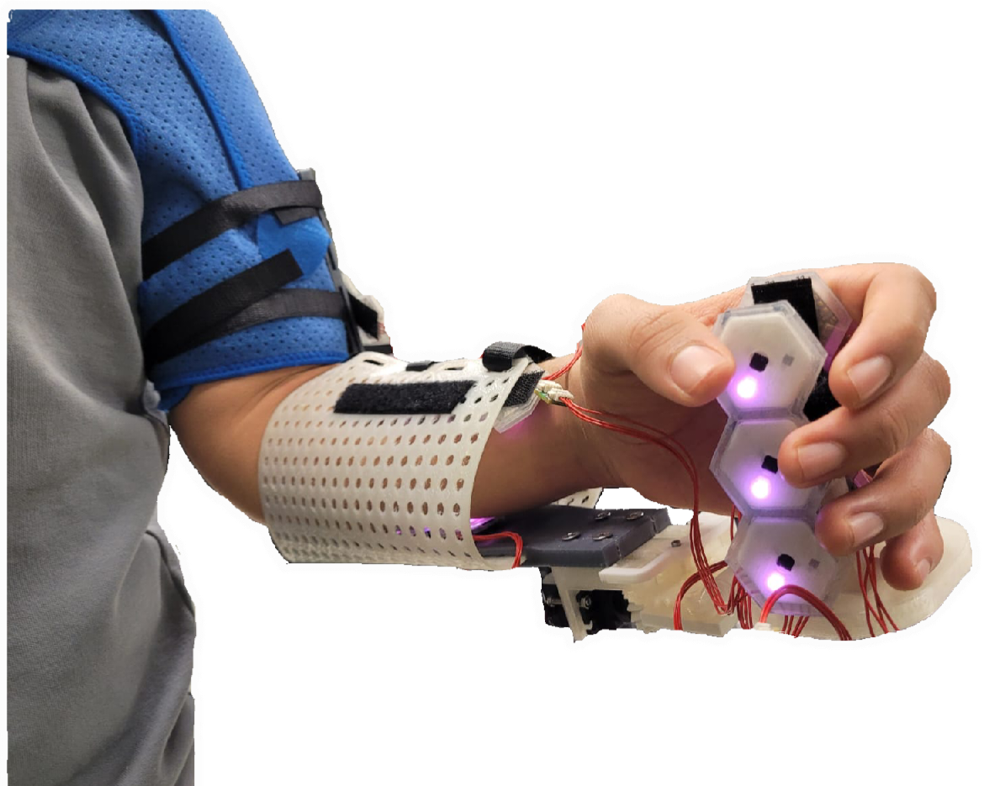
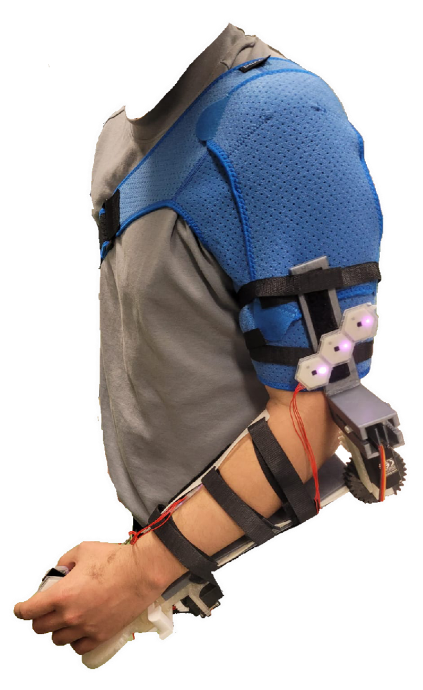
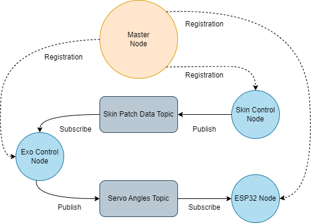
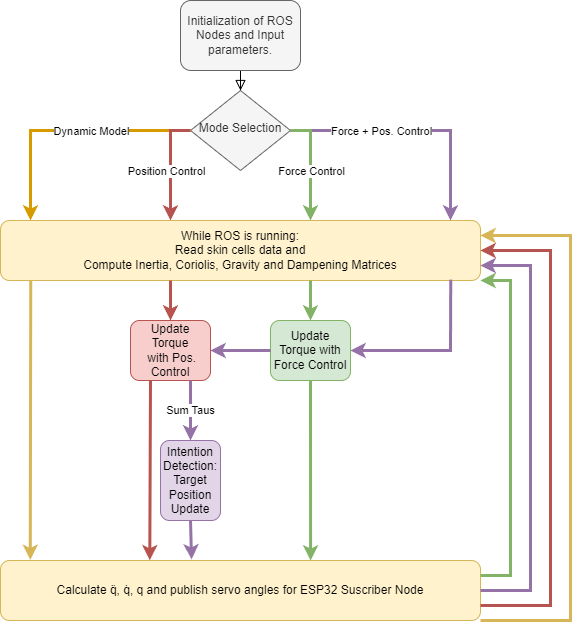

# Design and implementation of 2-DoF upper-limb exoskeleton with combined force and position control for rehabilitation
An upper-limb exoskeleton can facil-
itate the arm rehabilitation process after injuries or
neuromusculoskeletal diseases by providing additional
structural support and force. The main objective of
this project is the design and implementation of a functional upper-limb exoskeleton prototype. The mechanical design provides supportive torque and facilitates
elbow flexion-extension as well as wrist adduction-
abduction and flexion-extension. 

The main control
modalities are based on position control and force con trol. The intention detection algorithm combines force
control and a form of predictive position control.

The prototype’s functionality was tested by measuring the
muscular activity and computing the error between a
desired trajectory and the trajectory executed by the
user.
# Workspace tree

The main node is executed by launching main_exo_control.cpp. The ESP32 and skin cells must be running. See commands below to launch all nodes.
<pre>exo_ws
├── bagfiles
│   ├── test-11.bag
│   ├── traj2.bag
│   ├── traj5.bag
│   └── trajvar.bag
├── build
├── devel
├── init_master_ROS
├── init_slave_ROS
├── install
└── src
    ├── CMakeLists.txt
    ├── exo_control
    │   ├── CMakeLists.txt
    │   ├── include
    │   │   └── exo_control
    │   │       ├── exo_force_control.h
    │   │       └── exo_pos_control.h
    │   ├── launch
    │   │   ├── configs
    │   │   │   └── control_params.yaml
    │   │   └── exo_control.launch
    │   ├── package.xml
    │   └── src
    │       ├── Applications
    │       │   └── main_exo_control.cpp
    │       ├── exo_force_control.cpp
    │       └── exo_pos_control.cpp
    ├── rosserial
    ├── servo_control
    │   ├── CMakeLists.txt
    │   ├── include
    │   │   └── servo_control
    │   ├── package.xml
    │   ├── scripts
    │   │   └── publisher.py
    │   └── src
    └── skin_control
        ├── CMakeLists.txt
        ├── include
        │   └── skin_control
        ├── launch
        │   ├── config
        │   │   ├── patch1.xml
        │   │   ├── patch2.xml
        │   │   ├── patch3.xml
        │   │   ├── patch4.xml
        │   │   ├── patch5.xml
        │   │   └── patch_list.yaml
        │   └── skin_control.launch
        ├── package.xml
        └── src
            └── Applications
                └── main_skin_control.cpp
</pre>

# ROS
 
Run in different terminals:
<pre>
roscore
</pre>
<pre>  
rosrun rosserial_python serial_node.py /dev/ttyUSB0
</pre>
<pre>  
cd exo_ws
</pre> 
<pre> 
source ./devel/setup.bash
</pre> 
<pre> 
rosrun servo_control publisher.py
</pre> 
 

 
To send angle run (angle 30-120):

<pre> 
rostopic pub servo std_msgs/Float32 120.0 
</pre> 
 
launch cpp exo control :

<pre> 
roslaunch exo_control exo_control.launch
</pre> 
 
check skin :

<pre> 
skineventscmd
</pre> 
<pre> 
ftdi v2
</pre> 
<pre> 
c
</pre> 
 
 
configure skin :

<pre> 
roslaunch tum_ics_skin_full_config full_config.launch
</pre> 

 

launch cpp skin control :
<pre>
roslaunch tum_ics_skin_driver_events skin_driver_ftdi.launch FTDI_SERIAL:=FT601ZA5
</pre>
<pre> 
roslaunch skin_control skin_control.launch
</pre>
<pre> 
rostopic echo /patch1/data[0] 
</pre>
<pre> 
rosmsg show tum_ics_skin_msgs/SkinCellDataArray
</pre>
 
test rosbags
<pre> 
rosbag play test-11.bag
</pre>
<pre> 
rosrun plotjuggler plotjuggler
</pre> 
